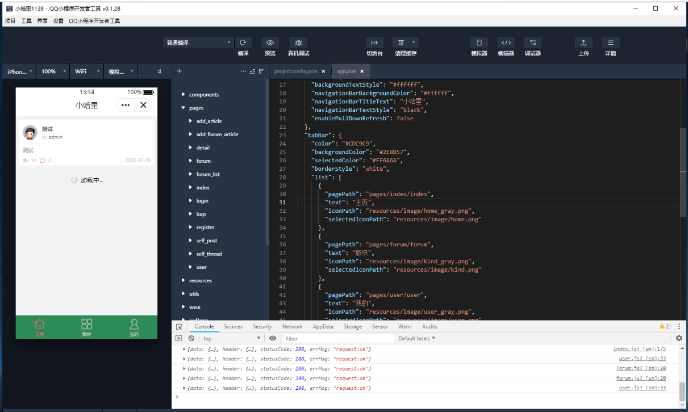

## discuz-qq-minapp

> 实现 Discuz 论坛接口的 QQ小程序

> 最后一次更新：2020.02.29

2020年做论坛开发的时候调的，之前的[另一个号](https://github.com/gwj1139177410/discuz-qq-minapp)找不到了，重新发一下。

虽然大概率不会更新，不过如果有Issues或Pull的话，请在这里提交。

#### 运行环境

+ PHP 5

+ Discuz 3

#### 安装方式

1. 将 wmapi 放到 Discuz 根目录下 ，访问 https://网址/wmapi/wmapi_install.php

2. 填写小程序 appid 以及 appsecret 进行安装（至此，论坛接口已安装完成）

3. wmapp 即为小程序源码，用QQ提供的开发者工具打开

4. 修改 app.js 下的 base_url 以及 svr_url 为你的网址

   base_url: 'https://www.xxxx.com/'

   svr_url: 'https://www.xxxx.com/wmapi/'

#### 参考资料：

当时主要参考了[2018-Discuz论坛微信小程序](https://github.com/DowneyL/discuz-wechat-miniprogram)和其他网上的一些项目，具体记不清了。

调试时该项目的微信接口也发生了变化，2020我写过一篇修改接口的[博客](https://blog.csdn.net/qq_33957603/article/details/104577121)。

